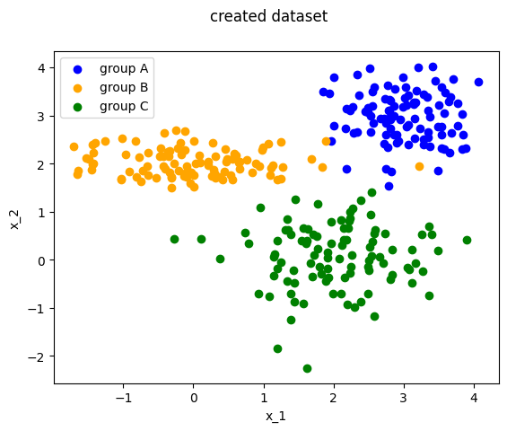
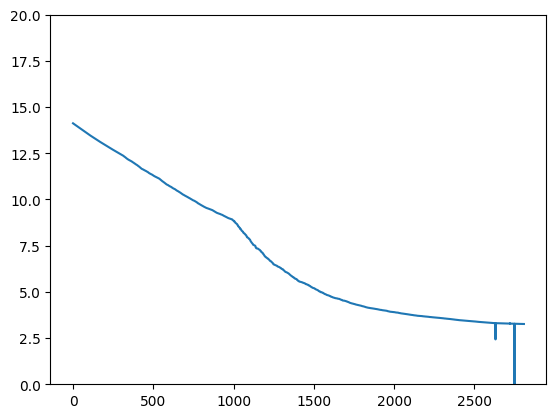
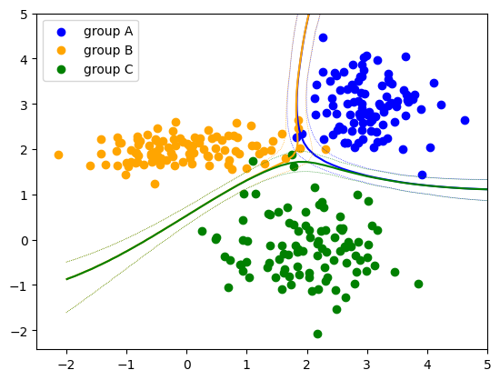

### Classification of 3 groups of points using a Pytorch neural network

The objective was to separate the 3 groups of points displayed below (group A, B, C) using a neural network.

The `GenerateData()` function is used to randomly create the datset. This function returns a TensorDataset.
Because of the way the `TensorDataset()` constructor is made, each data of the sample has been positionned in row. One row per data, and one column per dimension.
So in the TensorDataset returned object, the data are organised as follow : 

$$X_{train} = 
\left(\begin{array}{cc} 
x_{1,1} & ... & x_{1,m} \\
x_{2,1} & ... & x_{2,m}
\end{array}\right)^T = 
\left(\begin{array}{cc} 
x_{1,1} & x_{2,1} \\
... & ... \\
x_{1,m} & x_{2,m}
\end{array}\right)
$$ 

And ${Y_{train}}$ must be 1D.

The neural network is optimised so that the cost function decrease.

Once the network is trained, it's capable of classify the points regarding the patterns described in the following figure : 

